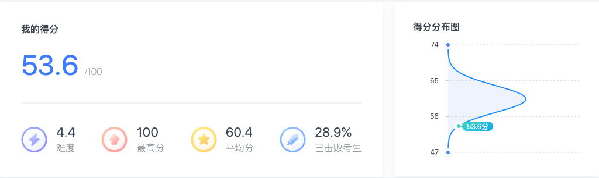

# 2021.01.19
限时做前一年行测真题并评分，树立benchmark

[2020年湖北省公务员录用考试《行测》试题（网友回忆版）](https://www.fenbi.com/spa/tiku/exam/practice/xingce/xingce/1203901422/3)

#### 常识判断（正确率60%）

#### 言语理解与表达（正确率65.7%）

#### 数量关系（正确率33.3%）

#### 判断推理（正确率37.1%）

#### 资料分析（正确率70%）

### 总结
此次花费3h时间完成第一次模拟试卷，数量关系和判断推理非常拉胯。需要对所有错题标记对应的题目类型的叶子节点，针对性练习。

### TODO:
0.错题改错，弄懂自己错在哪里
1.标记错题叶子节点
3.针对性制定计划：每个叶子结点做十五道题，做完对答案
