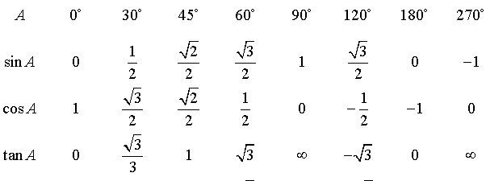
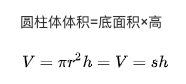

# 2021.01.19
- [x] 错题改错，弄懂自己错在哪里

- [x] 标记错题叶子节点

- [x] 针对性制定计划：每个叶子结点做十五道题，做完对答案

### 改错过程中一些忘记了的常识：

- 三角函数表：

- 圆柱体积公式：

圆锥体体积 = 1/3 * 圆柱体体积

- 排列组合中插板法必须满足三个条件：
  
（1） 这n个元素必须互不相异

（2） 所分成的每一组至少分得一个元素

（3） 分成的组别彼此相异

公式：

- 乞巧节又称七夕节

- 同比就是比去年同期，比如今年8月比去年8月。环比就是比上个月，今年8月比今年7月。

### 叶子节点现在可以在 [错题本](https://www.fenbi.com/spa/tiku/report/profile/xingce/xingce/tree/2) 上找到

### 针对性制定计划: 每天做2-3个叶子节点对应的题目（30-45道）并改错