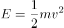

# 2021.01.24
- [x] 回顾2021.01.23改错的错题，在错题本上重做错题。

- [ ] 常识判断-科技常识筑基

- 多环芳香烃是煤、油类、煤气、木头、垃圾或其他有机物在不完全燃烧时形成的一类化学物质

- 金子：在自然界中以单质的形式存在，也就是说你挖到金子那就直接可以去做纯金链子了

- 世界最大口径光学红外望远镜：未建成，十三五有规划而已

- 胡萝卜属于十字花科萝卜属，在13世纪由伊朗引入中国（13改个数字这种题目压根就只能排除法做

- 生铁是铁碳合金

- 钢是以铁为主要元素+碳并含有少量的锰、硅、硫、磷等元素

- 含碳量：生铁 > 刚

- 动能公式：

- 机械能守恒定律：在下落过程中，重力势能转化为动能，但机械能总量保持不变。

- 一般情况下，金属的电阻随温度升高而增加，但是温度升高，半导体的电阻会随之降低，导电率升高

- 红壤的pH值小于7，是酸性土壤，土壤其实就是岩石风化变成的

- 酒精浓度为时，它的杀菌能力是最强

- 巴氏消毒法是一种低温消毒技术，除了常见的牛奶消毒还可用来给啤酒消毒

- 核磁共振是磁场成像，没有辐射，还能进行地下水探测（测量地层水中的氢核

- 电灯泡中加入少量红磷，是为了防止灯丝氧化（红磷易燃烧，会消耗掉电灯泡中的氧气